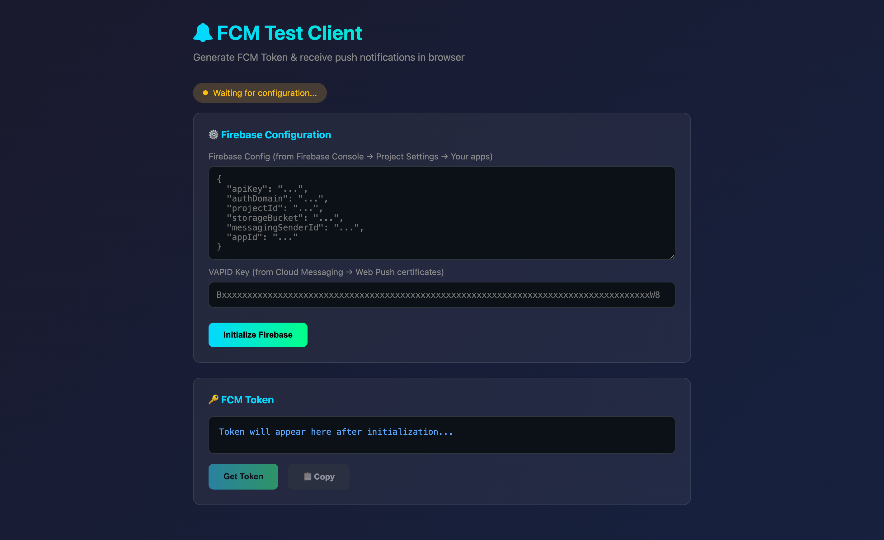

# FCM Test Client

Simple web-based client for testing FCM notifications.

## Setup

### 1. Get VAPID Key
From Firebase Console:
1. **Project Settings** → **Cloud Messaging**
2. Scroll to **Web Push certificates**
3. Click **Generate key pair** (if not exists)
4. Copy the Key pair value.

### 2. Prepare Firebase App Config
From Firebase Console:
1. **Project Settings** → **General**
2. Scroll to **Your apps** → Select/Create Web App
3. Copy the `firebaseConfig` JSON object.

### 3. Serve the Files
Service Worker requires an HTTP server. Run this from under **test-client** directory:
```bash
cd test-client && npx serve .
```

### 4. Open Browser
Go to: `http://localhost:3000/` (or the port provided by `serve`).

## Usage

1. Paste Firebase Config JSON in the first textarea
2. Paste VAPID Key in the input field
3. Click **Initialize Firebase**
4. Click **Get Token** (allow notification permission)
5. Copy the token

## Test Notification

Send to RabbitMQ queue `notification.fcm`:
```json
{
  "identifier": "test-001",
  "type": "promotional",
  "deviceId": "YOUR_TOKEN_HERE",
  "text": "Hello from RabbitMQ!"
}
```

## Files

| File | Description |
|------|-------------|
| `index.html` | Web UI for token generation & foreground monitoring |
| `firebase-messaging-sw.js` | Service Worker for background notifications |

## Why paste the config?

To keep the service secure and versatile, the config is stored in your browser's **IndexedDB**. This allows the Service Worker to initialize without hardcoded credentials in the source code.

## Screenshots

